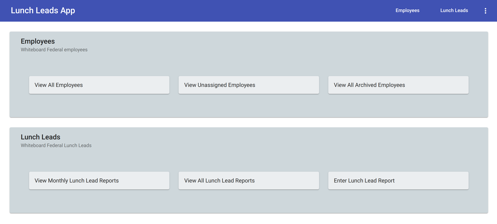

# Lunchleads

This project was generated with [Angular CLI](https://github.com/angular/angular-cli) version 8.3.17.

## Development server

Run `npm start` to start the dev server. Navigate to `http://localhost:4200/`. The app will automatically reload if you change any of the source files.

Make sure to start the lunch leads spring boot app with `./gradlew bootRun`.

## Basic Prototype

